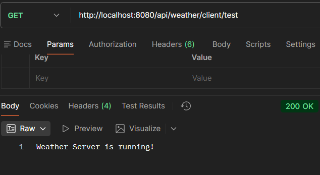
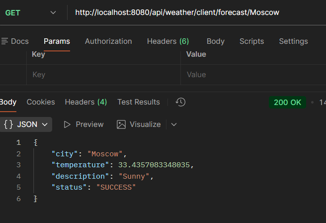
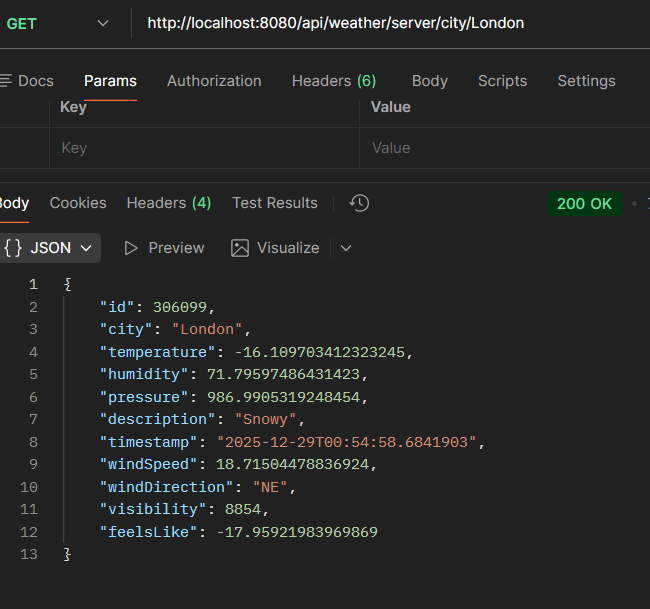
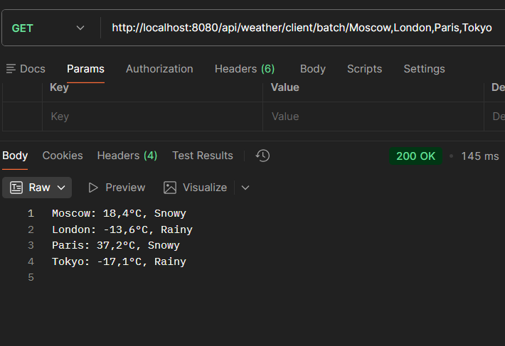
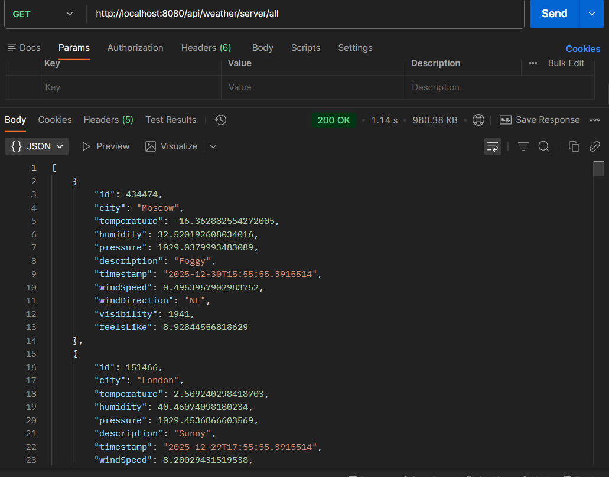
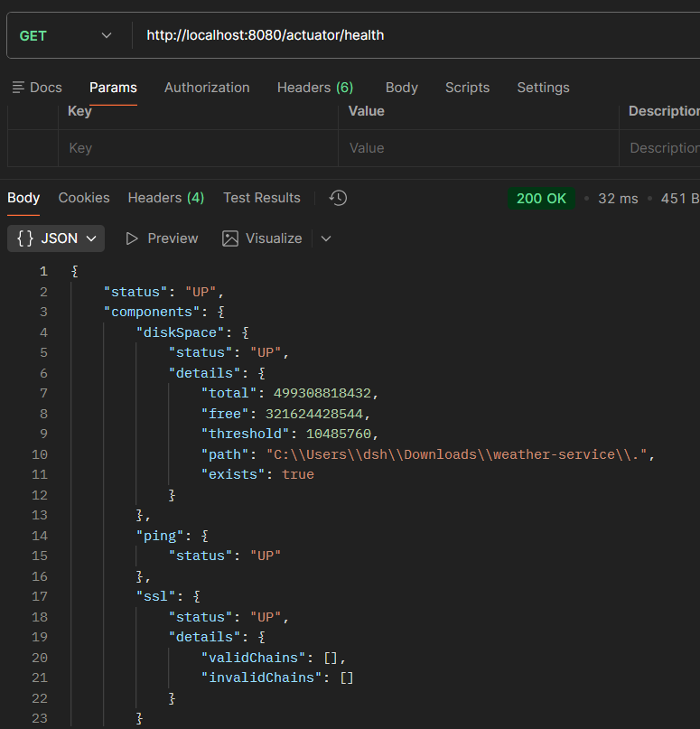
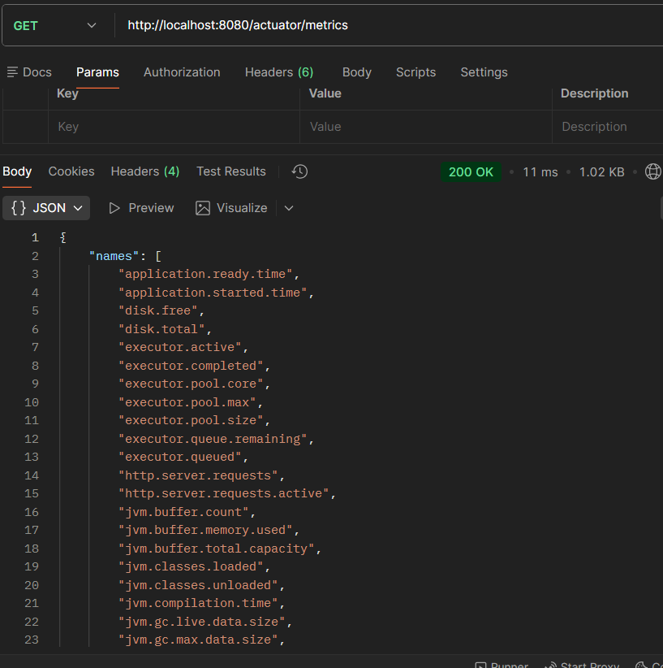
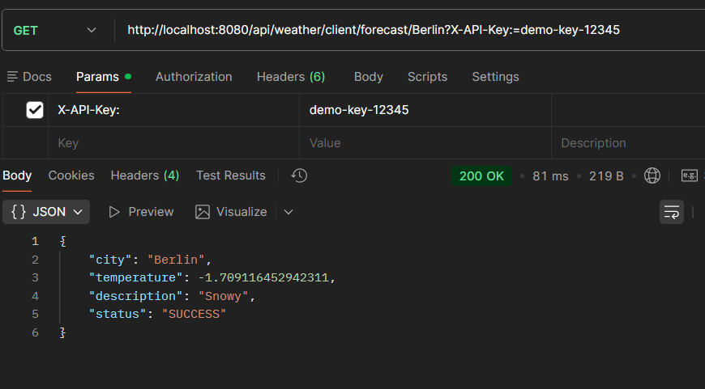

# Лабораторная работа №2 - Реактивный сервис прогноза погоды
## Описание проекта
Этот проект реализует реактивный сервис прогноза погоды с использованием Spring WebFlux и Project Reactor. Проект состоит из двух логических компонентов в одном приложении:

Сервис A (Weather Client) - реактивный веб-клиент, который отправляет запросы к серверному сервису, используя Spring WebClient с поддержкой асинхронных операций, обработки ошибок, повторных попыток и таймаутов.

Сервис B (Weather Server) - REST-сервис, который выполняет вычисления прогноза погоды и возвращает результаты в реактивном формате (Mono/Flux). Специально реализован с неоптимальной логикой для последующего профилирования и оптимизации.

## Структура проекта
```
weather-service/
├── src/main/java/com/example/weather/
│   ├── WeatherServiceApplication.java          # Главный класс приложения
│   ├── config/
│   │   └── WebClientConfig.java               # Конфигурация WebClient
│   ├── controller/
│   │   ├── ClientController.java              # Контроллер клиентского сервиса
│   │   └── ServerController.java              # Контроллер серверного сервиса
│   ├── service/
│   │   ├── WeatherClientService.java          # Сервис клиента (WebClient)
│   │   └── WeatherServerService.java          # Сервис сервера (REST)
│   ├── filter/
│   │   ├── LoggingFilter.java                 # Фильтр для логирования запросов
│   │   └── RequestFilter.java                 # Фильтр для обработки запросов
│   ├── model/
│   │   └── WeatherData.java                   # Модель данных погоды
│   └── dto/
│       └── WeatherResponse.java               # DTO для ответа клиента
├── src/main/resources/
│   └── application.yml                        # Конфигурация приложения
└── pom.xml                                    # Файл зависимостей Maven
```
## Технологии и зависимости
Java 17

Spring Boot 3.5.9

Spring WebFlux - для реактивного программирования

Project Reactor - реактивные типы Mono и Flux

Lombok - для сокращения boilerplate кода

Spring Actuator - для мониторинга приложения

## Запуск приложения
1. Сборка проекта
   ```
   mvn clean package
   ```
2. Запуск приложения
   ```
   mvn spring-boot:run
   ```
3. Проверка запуска
   После запуска приложение будет доступно по адресу: http://localhost:8080

В консоли появятся доступные эндпоинты:

Клиентские эндпоинты: http://localhost:8080/api/weather/client/...

Серверные эндпоинты: http://localhost:8080/api/weather/server/...

## Тестирование через HTTP-запросы
Тест клиента
```
GET http://localhost:8080/api/weather/client/test
```
Прогноз погоды для одного города (клиент → сервер)
```
GET http://localhost:8080/api/weather/client/forecast/Moscow
```
Прямой запрос к серверу
```
GET http://localhost:8080/api/weather/server/city/London
```
Пакетный запрос
```
GET http://localhost:8080/api/weather/client/batch/Moscow,London,Paris,Tokyo
```
Все данные с сервера (Flux)
```
GET http://localhost:8080/api/weather/server/all
```
Проверка здоровья
```
GET http://localhost:8080/actuator/health
```
Метрики приложения
```
GET http://localhost:8080/actuator/metrics
```
С API ключом
```
GET http://localhost:8080/api/weather/client/forecast/Berlin
X-API-Key: demo-key-12345
```
## Особенности неоптимальной реализации (для последующего профилирования)
В Сервисе B (Weather Server) специально реализованы неэффективные алгоритмы:
### Генерация 10,000+ записей при каждом запросе

Каждый запрос создает новый список из более чем 10,000 объектов WeatherData

Объекты создаются заново, даже если они уже были сгенерированы ранее

Нет кэширования сгенерированных данных

### Линейный поиск O(n) вместо O(1)

Используется последовательный перебор списка для поиска города

Вместо использования HashMap или других структур с быстрым доступом

### Лишние преобразования коллекций

Преобразование List → Set → List без необходимости

Каждое преобразование создает новые коллекции и копирует данные

### Двойная сортировка

Выполняются две сортировки одного и того же списка подряд

Вторая сортировка перезаписывает результат первой

### Многократная сериализация/десериализация JSON

Каждый объект сериализуется и десериализуется 5 раз подряд

Использование ObjectMapper для каждого цикла без оптимизации

### Создание большого количества промежуточных объектов

Генерация множества временных объектов String, List, Set

Постоянное создание новых Random объектов

## Реактивные возможности реализации
### 1. WebClient с настройкой таймаутов
   Таймаут соединения: 5 секунд

Таймаут чтения/записи: 5 секунд

Настраиваемые заголовки по умолчанию

### 2. Retry механизм
   3 повторные попытки при ошибках сети

Задержка 2 секунды между попытками

Логирование каждой попытки

### 3. Обработка ошибок
   Fallback значения при недоступности сервиса

Обработка различных HTTP статусов

Логирование ошибок с деталями

### 4. Фильтры запросов
   LoggingFilter: логирование всех входящих/исходящих запросов

RequestFilter: проверка API ключей и валидация параметров

Измерение времени выполнения запросов

### 5. Реактивные типы
   Mono для одиночных результатов

Flux для потоков данных

Асинхронная обработка всех операций

## Мониторинг и логирование
### Консольный вывод
При каждом запросе в консоли отображается:

Входящий запрос (метод, URL, источник)

Заголовки запроса

Время обработки запроса

Статус ответа

Ошибки (если возникают)

### Эндпоинты Actuator
/actuator/health - состояние приложения

/actuator/metrics - метрики производительности

/actuator/info - информация о приложении

## Параметры настройки
### Конфигурация приложения (application.yml):
Порт: 8080

Уровень логирования: DEBUG для пакета com.example.weather

Сжатие ответов: включено для текстовых типов контента

### Конфигурация WebClient:
Базовый URL: http://localhost:8080

Таймаут ответа: 5 секунд

Таймаут соединения: 3000 мс

Заголовки по умолчанию: Content-Type: application/json, User-Agent

### Параметры неоптимального кода:
Количество генерируемых записей: 10,000

Количество сериализаций: 5

Количество повторных попыток: 3

Задержка между попытками: 2 секунды

## Тесты







